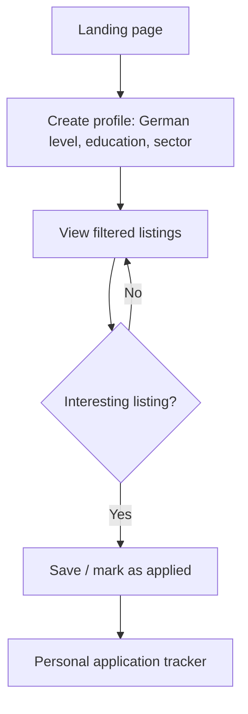

# Sprungbrett — Product & MVP Spec

2026-09-22 · Geraldine Hackmayer

Synthesized from `product-spec.md`, `mvp.md` / `mvp_1.md`.

Sprungbrett is a job-search platform that helps skilled immigrant professionals in Germany find roles that match their real qualifications — not just any job they can get with limited German.

## Problem

Thousands of skilled professionals who migrate to Germany (lawyers, administrators, engineers, etc.) spend years working unskilled jobs while learning German, even though they have solid training and experience from their home countries.

German job boards (StepStone, Indeed, LinkedIn) don't filter by the German level actually required, don't guide users on foreign-credential equivalency, and don't show which companies are open to hiring non-native speakers. This disconnects available talent from real opportunities and needlessly lengthens the professional transition.

## Target users

- **Primary persona:** a skilled immigrant professional in Germany, German level B1–B2, with a university degree or certification from their home country (law, administration, engineering, etc.), looking for their first qualified job in Germany.
- **Secondary persona:** mid-sized German companies that already hire, or are open to hiring, international staff but don't know how to reach this talent or how to communicate their language requirements realistically.
- **Out of scope initially:** people with no German at all (A0–A1) or with no prior professional background.

## Value proposition

Sprungbrett filters and labels every job listing by the German level actually required and by how open the company is to hiring non-native professionals — so users stop applying blindly and focus their energy on the listings where they have a real shot.

## MVP — hypothesis to validate

If we show real listings tagged by required German level and openness to international talent, skilled immigrant users will apply to more relevant listings and feel more confident in the process, compared to using generic job boards.

### MVP scope

| Included in the MVP | Out of scope (later phase) |
| --- | --- |
| Search with filter by German level (A1–C2), sector, and city | Automatic CV translator |
| Manual "immigrant-friendly" tag on each listing | Credential-equivalency guide (Anerkennung) |
| Basic user profile (German level, education, target sector) | Mentorship community |
| Save listings and mark application status (manual) | AI-powered interview prep |
| One resource page: CV tips for the German market | Full company directory with reviews |
| | Automatic personalized alerts |
| | Role-archetype identification + CV generator per archetype |
| | Sync and assisted application with LinkedIn/Indeed |

### User flow

The user sets up their profile once, filters listings by German level and sector, and manually tracks which ones they applied to.

### MVP success criteria

- 50 active users in the pilot's first 4 weeks (closed beta)
- At least 40% of registered users apply to at least 1 listing within the first 2 weeks
- At least 70% of survey respondents say the German-level filter saved them time or gave them more confidence to apply
- At least 5 companies willing to be listed as "immigrant-friendly" in the pilot

### Timeline & build approach

- **Weeks 1–2:** manually curate ~50–100 real listings (manual search/scraping) and tag them by German level and openness to non-native speakers.
- **Weeks 3–4:** build the search and user profile with no-code tools (e.g. Airtable + Softr or Glide) to validate quickly without custom development.
- **Week 5:** closed pilot with 50 users (personal network, Facebook/Telegram groups for immigrants in Germany).
- **Week 6:** gather feedback, measure success criteria, and decide whether to invest in custom development.

## Full vision — features beyond the MVP

1. Job search filtered by required German level (A1–C2), sector, and city. *(MVP)*
2. "Immigrant-friendly" tag on listings from companies that have hired international profiles before. *(MVP, manual)*
3. CV translator/adapter to German-market format and standards.
4. Credential-equivalency guide (Anerkennung) with official links by profession.
5. Directory of companies open to international talent, with reviews from other users.
6. Mentorship community: connects users with other immigrants who already landed a qualified job in the same field.
7. Interview prep tailored to German business culture.
8. German-progress tracking tied to job readiness (e.g. "you need 3 more months of B2 for this type of role").
9. Personalized alerts for new listings that match the profile.
10. Role matching: based on the profile (education, experience, certifications), suggests 2–3 "role archetypes" the user is most likely to succeed at.
11. CV generator per archetype: a CV (and cover letter) tailored to each suggested role archetype — instead of one generic CV for different roles.
12. Sync with LinkedIn, Indeed, and other job boards: automatic notifications when an external listing matches the profile and defined archetypes.
13. Assisted application (not fully automatic): autofills the external listing's application form with the data and CV for the matching archetype; the user confirms the final submission, since LinkedIn and Indeed prohibit automated-application bots in their terms of use and suspend accounts that use them.
14. Skills-gap analysis: compares the user's profile against each role archetype's requirements and suggests which certification or short course would close the gap fastest.
15. Salary benchmarking by role, sector, and city, to negotiate with real data.

### Success metrics (full vision)

- Monthly active users
- % of users who land an interview within the first 60 days
- % of users who land a qualified job (matching their training) within 6 months
- Number of companies registered as "immigrant-friendly"
- NPS / user satisfaction

## Risks & assumptions

- **Assumption:** there's enough real B1–B2-accepting job volume to sustain the product (validate against data from existing boards).
- **Risk:** companies may not want to be publicly labeled by the German level they require.
- **Risk:** dependence on external data sources (job-board APIs) to populate listings.
- **Assumption:** users are willing to share their German level and background to get more accurate recommendations.
- **Risk:** assisted application via unofficial LinkedIn/Indeed integrations could violate their terms of use and get accounts blocked — only use official integrations (e.g. the Indeed Publisher API for the listings feed), or keep that part as manual support (local autofill, with the user sending it themselves).

